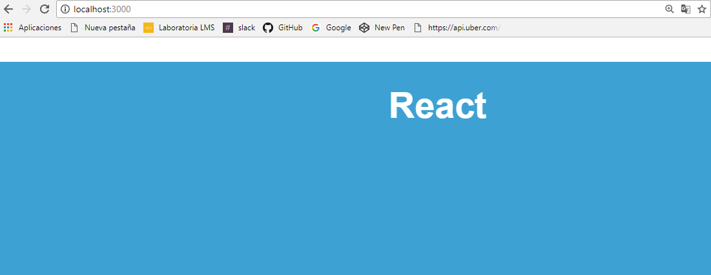

### RANDOM: 
Cada vez que recarga la pagina ejecuta una función random que cambia de color.




### Función para Random:
 

  ```js
   
        var col = "#";
        for (var i = 0; i < 6; i++)
          col += superRandomCharacters[Math.floor(Math.random() * 16)];
          let color = {backgroundColor: col}    
        return color;

  ```
